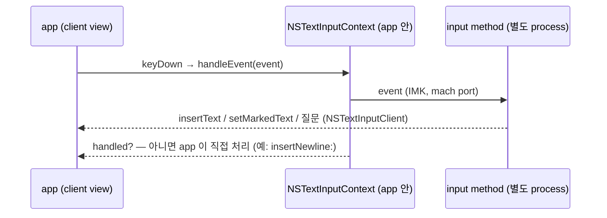

# macOS 입력 구조 — 배운 것

주인이 이 프로젝트로 배우는 macOS text input 의 구조. 확인된 사실과 추정을 구분하고 확인 방법을 붙인다.

- ✅ 확인 — 실험(`tis`·`probe` log, crash report)이나 source 로 봤다
- 🔶 추정 — 근거는 있으나 아직 확인하지 않았다

## key 하나가 글자가 되는 길



- input method 는 app 과 **다른 process** 다. app 안의 IMK 가 mach port 로 대화한다. ✅ (probe run 1 의 IMK error message)
- 입력기의 호출(`insertText`·질문)은 app 의 `handleEvent` **안에서** 온다 — app 은 입력기가 답할 때까지 기다린다. 한 key 에 11–33ms (probe 의 log 비용 포함). ✅ (probe run 2 의 중첩)
- 예외: input source 가 바뀔 때의 확정은 key 처리 **밖에서** 비동기로 온다. ✅ (run 2, 아래 Caps Lock 절)
- keyboard layout(ABC)도 같은 길을 간다. context 가 key 를 문자로 바꿔 `insertText` 하고 "handled" 를 돌려준다. Return·Delete 는 `doCommand`(`insertNewline:`·`deleteBackward:`)가 된다. ✅ (run 2)

## input source

- System Settings 의 "입력 소스" 목록 항목이 TIS input source 다. 두 종류: ✅ (`tis list`)
  - **keyboard layout** — key → 문자 표. 조합 없음. `com.apple.keylayout.ABC`
  - **input method** — 조합하는 program. 그 안에 **mode** 가 있고, 실제로 선택되는 단위는 mode 다.
    `com.apple.inputmethod.Korean` 안의 `com.apple.inputmethod.Korean.2SetKorean`
- input source 아래에 **keyboard layout 이 따로 깔린다.** 한국어 mode 아래는 숨은 layout `com.apple.keylayout.2SetHangul`. ✅ (`tis current`)
- 그래서 `NSEvent.characters` 는 layout 이 정한다 — 같은 `kc=5` 가 ABC 에서 `"g"`, 한국어 mode 에서 `"ㅎ"`. ✅ (probe run 1)
  → 우리 엔진이 `keyCode`(물리 위치)로 판단하는 이유.
- ASCII 입력 가능(ASCII-capable)한 것은 `ABC` 뿐이다. system 은 "가장 최근의 ASCII-capable source" 를 따로 기억한다. ✅ (`tis`)
  그 쓰임새(비밀번호 칸 등)는 🔶.
- TSM(Text Services Manager, HIToolbox)은 daemon 이 아니라 **app process 안의 library** 다 — Caps Lock LED 를 app 안의 TSM 이 조절하는 log 가 app 의 stderr 에 찍힌다. ✅ (probe run 1: `TSM AdjustCapsLockLEDForKeyTransitionHandling - _ISSetPhysicalKeyboardCapsLockLED Inhibit`)
- `NSTextInputContext` 는 **생성되자마자** client 에게 `validAttributesForMarkedText` 를 묻는다. ✅ (probe crash report — 이 질문을 기록하려다 무한 재귀)

## Caps Lock 한/영 전환 (system 방식)

probe run 1, 한→영:

```
41.212  flags   kc=57 capslock mods=⇪     누름 — app 은 "caps lock 켜짐" 을 받는다
41.245  flags   kc=255 mods=-             실제 key 가 아닌 kc=255 — system 이 caps lock 을 도로 끄는 합성 event
41.277  flags   kc=57 capslock mods=-     뗌
41.279  sys source → com.apple.keylayout.ABC   전환 확정: 누른 지 67ms 뒤
41.614  keyDown kc=5 chars="g"  ctx=ABC   335ms 뒤에 쳐서 새 source 로 처리됨
```

- 짧게 누르면 전환, 길게 누르면 대문자 고정이므로 system 은 떼는 순간을 봐야 전환을 확정한다. 확정이 늦게 온다. ✅ timing / 해석 🔶
- 전환은 key event 와 **다른 통로**(TIS distributed notification → app 의 context)로 app 에 전달된다.
  두 통로 사이에 순서 보장이 없으면, 전환 직후 친 key 가 이전 source 로 처리된다 — "한글 모드인데 첫 자음이 영문" 의 유력한 기전. 🔶
- 영→한 전환 직후 app 안의 IMK 가 입력기에 message 를 보내다 실패했다: `error messaging the mach port for IMKCFRunLoopWakeUpReliable`.
  run 2 에서는 새 app process 의 첫 key 에서 또 나왔다. 두 번 다 뒤 입력은 정상. app ↔ 입력기 통로가 실제로 삐끗한다는 증거. ✅ / 결함과의 관계 🔶
- 누름 → 전환 확정: 67·46 (run 1), 106·64·43·62ms (run 2). 매번 다르다. ✅
- **조합 중에 전환하면 확정이 key 처리 밖에서 온다** (run 2, 한→영):

  ```
  18.336  flags  kc=57 capslock mods=⇪
  18.358  flags  kc=255 mods=-
  18.374  insertText "글" repl={11,1}      ← 어느 handleEvent 에도 속하지 않는다
  18.379  sys source → ABC
  ```

  입력기는 비활성화될 때 스스로 조합을 확정해 넣는다. 이 확정과 다음 key 의 순서는 보장되지 않는다. 🔶
- **app 전환 때 system 이 문서별 input source 를 복원한다** ("문서의 입력 소스로 자동 전환"): probe 에서 ABC 로 바꾸고 나갔다 오자
  `app active` 18ms 뒤 `ctx source → ABC`. 그 18ms 안에 친 key 는 이전 app 의 source 로 간다. 🔶 — 또 하나의 "첫 글자" 경로.
- **⌘Tab 의 Tab 은 app 에 오지 않는다**: `flags ⌘` → `flags -` → `app inactive`. 사이에 keyDown 이 없다. 돌아오면 `flags kc=0 mods=-` 라는 합성 event 가 온다. ✅
  → 오른쪽 ⌘ 단독 tap 판정을 입력기가 본 event 만으로 하면 ⌘Tab 도 tap 으로 오판한다.

## Apple 한국어 입력기는 marked text 를 쓰지 않았다

probe run 1 (NSTextView), `한글` + Return:

```
keyDown kc=5  (g)  → insertText "ㅎ" [314E] repl={-,0}     확정해서 넣는다
keyDown kc=40 (k)  → insertText "하" [D558] repl={0,1}     방금 넣은 0번 글자를 바꿔치기
keyDown kc=1  (s)  → insertText "한" [D55C] repl={0,1}
keyDown kc=15 (r)  → insertText "한" repl={0,1}, insertText "ㄱ" [3131] repl={-,0}
keyDown kc=46 (m)  → insertText "그" [ADF8] repl={1,1}
keyDown kc=3  (f)  → insertText "글" [AE00] repl={1,1}
keyDown return     → insertText "글" repl={1,1} → doCommand insertNewline: → insertText "\n"
```

- 교과서 방식(`setMarkedText` 로 밑줄 친 조합 중 글자를 보이다가 확정 때 `insertText`)이 아니다.
  **확정해서 넣고, `replacementRange` 로 앞 글자를 바꿔치기** 한다. `setMarkedText` 호출이 한 번도 없다. ✅
- 이 방식은 입력기가 문서 위치(`{0,1}`, `{1,1}`)를 정확히 알고, client 가 `replacementRange` 를 정확히 지켜야 성립한다.
  문서 model 이 복잡하거나 비동기인 client(웹·Electron·terminal)에서 위치가 어긋나 "앞 글자와 이어 조합할 수 없다" 고 판단하면,
  자모가 하나씩 따로 확정된다 — **풀어쓰기와 같은 모양**. 🔶 (다른 client 에서도 이 방식인지부터 확인할 것)
- 낱자모는 호환 자모(U+3131–318E), 음절은 완성형(U+AC00–D7A3)으로 온다. ✅
- Return: 조합 중인 글자를 같은 자리에 다시 넣어 확정하고, Return 은 먹지 않는다 → app 이 `insertNewline:` 으로 처리. ✅
- 입력기가 client 에게 묻는 것은 `selectedRange`(key 마다 여러 번)·`hasMarkedText`·`validAttributesForMarkedText` 뿐이다.
  문서 내용(`attributedSubstring`)은 한 번도 묻지 않았다 — 조합 중인 음절의 위치를 cursor 위치로 계산해 바꿔치기한다. ✅ (run 2)
  조사: 이 입력기(KIM_Extension)는 app 의 text 를 cache 하는 비공개 IMK class 위에 있고 `unreliableApps` 같은 목록을 둔다 → `docs/research/app-compat-and-hangul.md` §3
- **Backspace 는 자모 단위, 역시 바꿔치기로** (run 2, `닭`):

  ```
  ㄷ ㅏ ㄹ ㄱ → "ㄷ" → "다" {4,1} → "달" {4,1} → "닭" {4,1}
  delete     → insertText "달" {4,1}
  delete     → insertText "다" {4,1}
  delete     → insertText "ㄷ" {4,1}
  delete     → insertText "ㄷ" {4,1} (확정) → doCommand deleteBackward:   마지막 자모는 app 이 지운다
  ```

- **도깨비불**은 insertText 두 번: `일` + ㅓ → `insertText "이" {16,1}` + `insertText "러"`. ✅ (run 2)

## homi 첫 설치 (M0)

- **등록**: `TISRegisterInputSource` 뒤 parent 에 `TISEnableInputSource` 가 성공(0)을 돌려주고도 parent 는 꺼진 채였고, mode 만 켜졌다 (조사의 qingjian#209 와 같은 증상).
  주인이 menu 에서 homi 를 고른 뒤에는 parent 도 켜졌다. system 이 저장하는 `AppleEnabledInputSources` 에는 바로 나타나지 않았다. ✅ / 이유 🔶
- system 은 homi 를 **고르는 순간** 띄운다 (부모 process = launchd). 입력칸이 바뀔 때마다 `activateServer`·`deactivateServer` 가 오고,
  같은 app 안에서도 3ms 안에 deactivate → activate → deactivate 가 몰려오는 일이 있다. ✅
- homi 아래 keyboard layout 은 **ABC** 다 (`tis current`). `handle()` 이 NO 를 돌려주면 context 가 그 layout 으로 `insertText` 한다 — app 쪽에서는 ABC 와 구별되지 않는다. ✅
- **homi 를 고른 동안 Caps Lock 은 input source 전환이 아니라 진짜 대문자 고정이다** (`chars="D" mods=⇪`). homi 는 `TICapsLockLanguageSwitchCapable` 을 선언하지 않았다.
  조사(gureum#883)와 맞고, M3 에서 Caps Lock 을 직접 다룬다는 전제가 선다. ✅
- ⌃Space 로 input source 를 바꾸면 app 은 ⌃ 의 flags 만 보고 Space 는 못 본다 — ⌘Tab 과 같다. ✅
- homi 를 고른 채 probe 로 돌아오자 system 이 문서별 기억으로 **ABC 를 되살렸다**. "문서의 입력 소스로 자동 전환" 이 homi 의 앱별 기억과 싸우리라는 예상의 실증이다. ✅
- IMK 의 `error messaging the mach port for IMKCFRunLoopWakeUpReliable` 은 세 번째 — 새 source·새 client 와의 첫 상호작용마다 나오고, 매번 무해했다. ✅
- LaunchServices: app 을 죽이자마자 `open` 하면 -600 — 죽어가는 process 에 붙으려 한다. 종료를 기다린 뒤 연다 (`scripts/probe.sh`). ✅

## HangulCore 를 만들며 (M1)

- **TIS API 는 main thread 에서만 부른다.** test 들이 병렬로 돌며 여러 thread 에서 `TISCreateInputSourceList` 를 부르자 process 가 abort(signal 6)했다. 직렬로는 통과했다. ✅
- Apple 의 `2SetHangul` layout 은 key 26개 × Shift 유무 52가지 모두 homi 의 두벌식 표와 같다 — Shift 는 ㅃㅉㄸㄲㅆㅒㅖ 만 바꾸고, 나머지 key 는 Shift 여도 같은 자모다. ✅ (`UCKeyTranslate` 대조 test)

## homi 가 한글을 조합하다 (M2)

- homi 는 조합 중인 글자를 `setMarkedText` 로 보이고, 음절이 넘어갈 때만 `insertText` 로 확정한다. `replacementRange` 는 늘 NSNotFound. ✅ (probe run 3)

  ```
  ㅇ ㅜ ㄹ   → setMarked "ㅇ" → "우" → "울"
  ㅣ         → insertText "우" + setMarked "리"     도깨비불
  space      → insertText "가" → (app 이) " "
  ㄴ ⌫       → setMarked ""                        조합 중 Backspace 는 homi 가
  ⌫          → doCommand deleteBackward:           조합이 없으면 app 이
  ```

- homi 는 marked text 안의 선택을 `{글자 수, 0}`(커서를 글자 뒤로 — ongeul 과 같은 값)으로 보냈는데, app 은 `{0, 글자 수}`(전체 선택)로 받았다.
  IMK 가 중간에서 바꾼 것으로 보인다. 🔶 원인 미확인 — 화면에 드러난 문제는 아직 없다.
- **Telegram(`ru.keepcoder.Telegram` 12.9, native AppKit)에서 Apple 두벌식이 초성을 잃었다**: `아` 를 치면 `ㅏ` 만 남는다 (주인 관측, 2026-09-25).
  같은 곳에서 homi 로는 재현되지 않았다. Apple 입력기의 바꿔치기 방식이 app 의 문서 위치 답과 어긋날 때의 모양으로 보인다 🔶 — 결정 5(marked text)의 근거 하나.
- **Telegram 에서 조합 중에 누른 Enter 는 전송이 아니라 줄바꿈이 된다** (주인 보고 — Apple 입력기 때부터). 원인은 Telegram 의 규칙이다 ✅ source:
  `TelegramSwift/packages/InputView/Sources/InputView/ChatInputTextView.swift` `keyDown` (a404806, 2025-06-30) —
  Enter 는 `!self.hasMarkedText()` 일 때만 전송하고, 조합 중이면 `super.keyDown` 으로 입력기에 넘긴다 → 입력기가 확정 → `insertNewline`.
  일본어·중국어의 "Enter = 변환 확정" 관례다. marked text 를 쓰는 homi 도 같다.
  고치려면: 조합 중 Enter 를 확정하고 먹은 뒤 Enter 를 다시 보낸다 → 손쉬운 사용 권한 + 고정 서명 (AGENTS.md 열린 결정, M4).

## 한/영 전환 key (M3)

- **Caps Lock → F18 remap 은 관리자 권한 없이 걸린다** (`hidutil property --set '{"UserKeyMapping":[…]}'`, macOS 27 26A428). ✅
  공개 API `IOHIDEventSystemClientSetProperty(…, "UserKeyMapping", …)` 로 homi 가 직접 건다 — homi 가 선택된 동안에만.
- remap 된 Caps Lock 은 입력기에 **평범한 keyDown** 으로 온다: `kc=79 chars=U+F715 mods=fn`. 대문자 고정을 바꾸는 flagsChanged 는 한 번도 없었다. ✅ (probe)
  → 다음 key 와 같은 흐름이라 "전환 → 다음 key" 순서가 보장되고, 불빛·누름 지연·system 의 Caps Lock 전환이 끼어들 자리가 없다.
- F18 은 fn 수식키를 달고 온다 — 전환 판정을 수식키 검사보다 먼저 해야 한다. ✅
- `recognizedEvents` 가 keyDown 말고 다른 event 도 받겠다고 하면, IMK 의 기본 mouse 처리(조합 영역 밖 click → `commitComposition`)가 꺼진다.
  그래서 homi 는 leftMouseDown 도 받아 직접 확정한다. ✅ `IMKInputController.h` (recognizedEvents 주석)
- **전환 직후의 첫 key 는 늘 새 모드였다** — Caps Lock(F18)·오른쪽 ⌘ tap·Shift+Space 로 35번 전환, 틀린 경우 0. 조합 중 전환은 먼저 확정한다 (`insertText "아"`). ✅ (probe run 4)
  "재현 안 됨" 이 아니라 구조가 막는 것이다 — 전환 key 와 다음 key 가 같은 흐름에서 차례로 처리된다 (`ToggleTests` 가 고정).

## app 은 "입력기가 key 를 먹었다" 를 제각각 판정한다 (M4)

입력기가 `handle` 에서 YES(먹었다)를 돌려줘도, app 이 그 대답을 보지 않고 key 를 스스로 처리하는 경우가 있다. source 로 확인한 규칙:

| app | key 를 app 이 처리하지 않는 조건 (그 밖에는 key 를 스스로 보낸다) | source |
|---|---|---|
| Ghostty | ① 이 key 전에 조합 중이었다 (그때는 확정 글자만 보내고, 화살표 말고는 key 를 버린다) ② 입력기가 **비지 않은** 글자를 `insertText` ③ key 처리 중 **keyboard layout 이 바뀌었다** ("an input method grabbed it") | `macos/Sources/Ghostty/Surface View/SurfaceView_AppKit.swift` `keyDown`, `String.keyEventText` |
| iTerm2 (기본 설정) | ① 조합 중이었다 ② 입력기가 **1글자 이상** `insertText` ③ 처리 뒤 marked text 가 남았다. 입력기의 YES 는 실험 설정(experimentalKeyHandling)에서만 본다 | `sources/Keyboard/iTermKeyboardHandler.m` `shouldPassPostCocoaEventToDelegate`, `insertText` |
| IntelliJ (JetBrains Runtime) | marked text 가 있거나, 입력기가 **빈 marked text 를 세웠거나** `insertText` 로 넣었다 (`fKeyEventsNeeded = NO`) | `src/java.desktop/macosx/native/libawt_lwawt/awt/AWTView.m` `keyDown`, `setMarkedText` |
| Telegram | Enter 는 marked text 가 없을 때만 전송 | `TelegramSwift/packages/InputView/…/ChatInputTextView.swift` `keyDown` |

그래서 관측된 것 ✅ (주인, 2026-09-25):
- 영문 → 한글 전환처럼 **조합도 글자도 없이 먹은 key** 는 terminal 로 샌다 — Caps Lock 을 F18 로 받았을 때 Ghostty 에 F18 의 문자 U+F715(``)가, Shift+Space 로 전환하면 space 가 들어갔다.
  한글 → 영문 전환은 조합 중이던 글자를 확정하는 `insertText` 가 곧 "먹었다" 가 되어 새지 않았다.
- 빈 `insertText("")` 는 Ghostty·iTerm2 둘 다 "글자 없음" 으로 본다. marked text 를 세웠다 지우는 신호(macSKK 방식)도 Ghostty·iTerm2 에는 통하지 않는다.
- 결론: **전환 key 는 글자를 만들지 않는 수식키여야 한다.** Caps Lock 은 오른쪽 Control 로 remap 해 tap 으로 받고, Shift+Space 전환은 없앴다.

## key 다시 보내기 (M4)

- 조합 중 Enter(Telegram)·ESC(terminal vim)는 확정한 뒤 그 key 를 먹고 **다시 보낸다** — 두 번째 key 가 도착할 때는 marked text 가 없다. ✅ 주인 확인 (Telegram 전송, Ghostty·iTerm2 vim ESC 한 번)
- **원래 event 를 복사해 보내면 닿지 않는다**: `NSEvent.cgEvent.copy()` 를 key 처리 도중에 `post` 했더니 Telegram 에서 "틱" 소리만 나고 Enter 가 사라졌다.
  Telegram 의 전송 조건(`flags == 0` + 입력칸에 글자)은 맞았으므로 event 가 입력칸에 닿지 않은 것이다. ✅ (homi 기록 + TelegramSwift source)
  → **새 event** 를 만들어(`CGEvent(keyboardEventSource:virtualKey:keyDown:)`, key code 와 수식키만 옮김) **원래 key 처리가 끝난 뒤**(`DispatchQueue.main.async`) HID 경로(`.cghidEventTap`)로 보내니 됐다. ✅
  원인이 복사본에 딸린 창·시각 정보인지, 처리 도중에 보낸 시점인지는 가르지 않았다. 🔶
- 다시 보내려면 **손쉬운 사용** 허가가 있어야 한다(`CGPreflightPostEventAccess`). macOS 27 의 System Settings 에서는 개인정보 보호 및 보안의 **Device & Data Access** 아래에 있다 (주인 확인).
  `x-apple.systempreferences:com.apple.preference.security?Privacy_Accessibility` 가 그 화면을 연다. homi 가 목록에 없으면 "+" 로 `~/Library/Input Methods/homi.app` 을 넣는다.
- 허가는 서명 신원(bundle ID + 인증서)에 붙는다 — 자체 서명 인증서로 서명하니 다시 build·설치해도 유지됐다. ✅

## 모드 표시 (M4)

- **menu bar 표시(NSStatusItem)는 앱 객체(`NSApplication.shared`)가 있은 뒤에 만들어야 한다.** 먼저 만들면 오류 없이 **아무것도 생기지 않는다** —
  homi 가 창을 하나도 갖지 않은 것(`CGWindowListCopyWindowInfo`)으로 확인했다. ✅ (2026-09-25)
- **커서 옆 말풍선**: 모드가 실제로 바뀔 때(전환 key, ESC trigger) 커서 줄 아래에 "한"/"A" 를 잠깐 띄운다 — Apple 입력기의 표시처럼. ✅ 주인 확인
  - 위치는 `attributes(forCharacterIndex: 0, lineHeightRectangle:)` 로 묻는다 — 입력기가 후보 창을 띄울 때 쓰는 질의.
    **key 처리 도중에만** 묻는다: app 이 homi 를 기다리는 그때가 안전하고, 그 밖에서 client 를 부르면 Chrome 과 교착한 사례가 있다 (조사: az#317).
  - 그리기는 key 처리 뒤로 미룬다 (`Task @MainActor`). NSPanel(borderless·nonactivating, `.popUpMenu` level) + NSVisualEffectView(`.popover`).
- **대문자 고정 표시는 macOS 에 맡긴다.** homi 가 IOKit 으로 Caps Lock 상태를 바꾸면 macOS 가 자기 표시를 띄운다 — homi 가 따로 띄우면 겹쳤다 (주인). ✅
- **macOS 는 대문자 고정이 켜진 동안 입력을 멈출 때마다 커서 아래에 표시를 띄운다** (Sonoma 부터의 표준 동작 — homi 와 무관). ✅ 주인 관측
  끄는 방법은 `sudo defaults write /Library/Preferences/FeatureFlags/Domain/UIKit.plist redesigned_text_cursor -dict-add Enabled -bool NO` + 재부팅이라고 한다 🔶
  (macobserver·macmost). 입력 소스 전환 popup 을 끄는 `TSMLanguageIndicatorEnabled` 와는 다른 설정이다. 주인은 끄지 않기로 했다 (2026-09-25).
- **대문자 고정은 누르고 있는 동안 켜진다**: Caps Lock 을 단독으로 0.5초 누르고 있으면 그때 뒤집는다 (timer + `ModifierTap.holdReached`) — 뗄 때 판정했더니
  macOS 와 달리 떼야 켜졌다 (주인). 그 사이에 다른 key 가 눌리면(system 누름 횟수가 변하면) 아니다. ✅

## 알려진 화면 문제

- **Ghostty**: 한글 조합 중에 수식키(Caps Lock·오른쪽 ⌘)로 전환하면, 확정된 마지막 글자가 선택된 것처럼 보이다가 다음 key 에 사라진다. 글자는 제대로 들어간다(`한a`). ✅ 주인 관측
  전환이 flagsChanged 처리 중이라 확정이 keyDown 밖에서 일어나는 경우의 Ghostty 쪽 다시 그리기 문제로 보인다 🔶 — M5 에서 다시 본다.

## 관측 기록

| 날짜 | 실험 | 비고 |
|---|---|---|
| 2026-09-25 | `tis list`·`current` | 주인 환경: ABC + Apple 두벌식 |
| 2026-09-25 | probe run 1 — Caps Lock 전환, `gks`, `한글` + Return | Apple 두벌식, NSTextView (probe 초판, bundle 없이 실행) |
| 2026-09-25 | probe run 2 — `한글` + space + Return, `닭` + Backspace, Caps Lock 직후 입력, 중간중간 ⌘Tab | handleEvent 중첩·질문 기록 추가, bundle 로 실행. 첫 글자 영문은 재현 안 됨 (전환 후 200ms 넘게 뒤에 쳤다) |
| 2026-09-25 | M0 — homi(빈 입력기) 등록·선택, probe 에 알파벳·Shift+Space·Caps Lock | homi 의 lifecycle log(`log stream`)와 probe log 를 함께 봤다 |
| 2026-09-25 | M2 — homi 로 probe 와 여러 app 에서 한글 입력 (probe run 3) | Telegram 의 Apple 입력기 초성 유실을 주인이 관측, homi 로는 재현 안 됨 |
| 2026-09-25 | Caps Lock → F18 remap 실험 (hidutil) | homi 가 kc=79 keyDown 으로 받음, 실험 후 되돌림 |
| 2026-09-25 | M3 — 전환 key 셋 (probe run 4) + 주인이 여러 app 에서 확인 | Telegram 의 조합 중 Enter 는 여전히 줄바꿈 (M4 과제) |
| 2026-09-25 | M4 — app 별 기억·규칙, 다시 보내기, 전환 key 재설계 (주인이 여러 app 에서 확인, homi 기록 1건) | Ghostty·iTerm2·IntelliJ·Telegram 의 key 처리 source 확인 |
