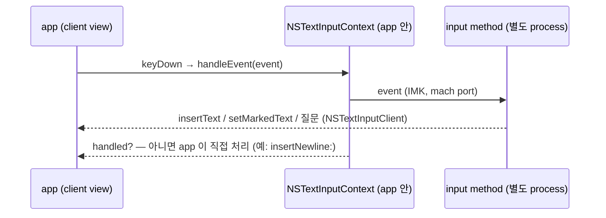

# macOS 입력 구조 — 배운 것

주인이 이 프로젝트로 배우는 macOS text input 의 구조. 확인된 사실과 추정을 구분하고 확인 방법을 붙인다.
app 하나에만 딸린 사실은 app 원장(`docs/apps/`)에, 고친 결함의 경과는 `docs/lessons.md` 에 있다.

- ✅ 확인 — 실험(`tis`·`probe` log, homi 기록, crash report)이나 source 로 봤다
- 🔶 추정 — 근거는 있으나 아직 확인하지 않았다

## key 하나가 글자가 되는 길



- input method 는 app 과 **다른 process** 다. app 안의 IMK 가 mach port 로 대화한다. ✅ (probe 의 IMK error message)
  새 source·새 client 와 처음 주고받을 때마다 `error messaging the mach port for IMKCFRunLoopWakeUpReliable` 이 나왔고, 매번 무해했다. ✅
- 입력기의 호출(`insertText`·질문)은 app 의 `handleEvent` **안에서** 온다 — app 은 입력기가 답할 때까지 기다린다. 한 key 에 11–33ms (probe 의 log 비용 포함). ✅
- 예외: input source 가 바뀔 때의 확정은 key 처리 **밖에서** 비동기로 온다. ✅ (아래 Caps Lock)
- 입력기가 NO(안 먹었다)를 돌려주면 context 가 key 를 그 아래 keyboard layout 으로 문자로 바꿔 `insertText` 한다.
  Return·Delete 는 `doCommand`(`insertNewline:`·`deleteBackward:`)가 된다. ✅
- `NSTextInputContext` 는 **생성되자마자** client 에게 `validAttributesForMarkedText` 를 묻는다. ✅ (probe crash report — 이 질문을 기록하려다 무한 재귀)
- TSM(Text Services Manager, HIToolbox)은 daemon 이 아니라 **app process 안의 library** 다 — Caps Lock LED 를 조절하는 TSM 의 log 가 app 의 stderr 에 찍힌다. ✅

## input source 와 keyboard layout

- System Settings 의 "입력 소스" 목록 항목이 TIS input source 다. ✅ (`tis list`)
  - **keyboard layout** — key → 문자 표. 조합 없음. `com.apple.keylayout.ABC`
  - **input method** — 조합하는 program. 그 안의 **mode** 가 실제로 선택되는 단위다. `com.apple.inputmethod.Korean` 안의 `….Korean.2SetKorean`
- **input method 아래에도 keyboard layout 이 따로 깔린다** ✅ (`tis current`). Apple 두벌식 아래는 숨은 layout `com.apple.keylayout.2SetHangul`
  (key 마다 자모 하나를 낸다), homi 아래는 ABC. 입력기는 IMK 의 `overrideKeyboardWithKeyboardNamed:` 로 자기 아래 layout 을 고른다 —
  homi 는 activate 때 ABC 로 둔다 (Remote Desktop 의 한글 모드만 `2SetHangul`, 아래). 고를 layout 이 입력 소스 목록에 켜져 있을 필요는 없다. ✅
- `NSEvent.characters` 는 이 layout 이 정한다 — 같은 `kc=5` 가 ABC 에서 `"g"`, 두벌식에서 `"ㅎ"`. 그래서 homi 는 `keyCode`(물리 위치)로 판단한다. ✅ (probe)
- ASCII 입력 가능(ASCII-capable)한 것은 `ABC` 뿐이다. system 은 "가장 최근의 ASCII-capable source" 를 따로 기억한다 — 그 쓰임새(비밀번호 칸 등)는 🔶.
- TIS API 는 main thread 에서만 부른다 — 병렬 test 가 여러 thread 에서 `TISCreateInputSourceList` 를 부르자 process 가 abort(signal 6)했다. ✅
- **등록**: `TISRegisterInputSource` 뒤 parent 에 `TISEnableInputSource` 가 성공(0)을 돌려주고도 parent 는 꺼진 채였고 mode 만 켜졌다
  (조사의 qingjian#209 와 같은 증상). menu 에서 homi 를 고른 뒤에는 parent 도 켜졌다. ✅ / 이유 🔶
- system 은 입력기를 **고르는 순간** 띄운다 (부모 process = launchd). 입력칸이 바뀔 때마다 `activateServer`·`deactivateServer` 가 오고,
  같은 app 안에서도 3ms 안에 deactivate → activate → deactivate 가 몰려오는 일이 있다. ✅

## Apple 한국어 입력기가 하는 일

### marked text 없이 확정하고 바꿔치기한다

probe run 1 (NSTextView), `한글` + Return:

```
keyDown kc=5  (g)  → insertText "ㅎ" [314E] repl={-,0}     확정해서 넣는다
keyDown kc=40 (k)  → insertText "하" [D558] repl={0,1}     방금 넣은 0번 글자를 바꿔치기
keyDown kc=1  (s)  → insertText "한" [D55C] repl={0,1}
keyDown kc=15 (r)  → insertText "한" repl={0,1}, insertText "ㄱ" [3131] repl={-,0}
keyDown kc=46 (m)  → insertText "그" [ADF8] repl={1,1}
keyDown kc=3  (f)  → insertText "글" [AE00] repl={1,1}
keyDown return     → insertText "글" repl={1,1} → doCommand insertNewline: → insertText "\n"
```

- 교과서 방식(`setMarkedText` 로 밑줄 친 조합 중 글자를 보이다가 확정 때 `insertText`)이 아니다.
  **확정해서 넣고, `replacementRange` 로 앞 글자를 바꿔치기** 한다. `setMarkedText` 호출이 한 번도 없다. ✅
- 이 방식은 입력기가 문서 위치를 정확히 알고, client 가 `replacementRange` 를 정확히 지켜야 성립한다. 문서 model 이 복잡하거나 비동기인
  client(웹·Electron·terminal)에서 위치가 어긋나면 자모가 따로 확정된다 — **풀어쓰기와 같은 모양** 🔶.
  Telegram(NSTextView)에서 Apple 두벌식이 초성을 잃은 것(`아` → `ㅏ`, 주인)도 이 방식이 어긋난 모양으로 본다 — homi 로는 재현되지 않았다 🔶. 결정 5 의 근거다.
- 입력기가 client 에게 묻는 것은 `selectedRange`(key 마다 여러 번)·`hasMarkedText`·`validAttributesForMarkedText` 뿐이다.
  문서 내용은 묻지 않고 조합 중인 음절의 위치를 cursor 위치로 계산한다. ✅ (run 2)
  이 입력기는 app 의 text 를 cache 하는 비공개 IMK class 위에 있고 `unreliableApps` 같은 목록을 둔다 (조사 → `docs/research/app-compat-and-hangul.md` §3).
- 낱자모는 호환 자모(U+3131–318E), 음절은 완성형(U+AC00–D7A3)이다. Backspace 도 자모 단위의 바꿔치기이고 마지막 자모는 app 이 지운다(`deleteBackward:`).
  도깨비불은 `insertText` 두 번(`일`+ㅓ → `이` 바꿔치기 + `러`). Return 은 조합 중인 글자를 같은 자리에 다시 넣어 확정하고 먹지 않는다 → app 이 `insertNewline:`. ✅ (run 2)

### Caps Lock 전환은 key 와 다른 통로로 늦게 온다

probe run 1, 한→영:

```
41.212  flags   kc=57 capslock mods=⇪     누름 — app 은 "caps lock 켜짐" 을 받는다
41.245  flags   kc=255 mods=-             실제 key 가 아닌 kc=255 — system 이 caps lock 을 도로 끄는 합성 event
41.277  flags   kc=57 capslock mods=-     뗌
41.279  sys source → com.apple.keylayout.ABC   전환 확정: 누른 지 67ms 뒤
41.614  keyDown kc=5 chars="g"  ctx=ABC   335ms 뒤에 쳐서 새 source 로 처리됨
```

- 짧게 누르면 전환, 길게 누르면 대문자 고정이라 system 은 떼는 순간을 봐야 전환을 확정한다 — 누름 → 확정 43–106ms, 매번 다르다. ✅ timing / 해석 🔶
- 전환은 key event 와 **다른 통로**(TIS 알림 → app 의 context)로 온다. 두 통로 사이에 순서 보장이 없으면 전환 직후 친 key 가 이전 source 로 처리된다 —
  "한글 모드인데 첫 자음이 영문" 의 유력한 기전이다 🔶. probe 에서는 재현하지 못했다 — 전환 뒤 200ms 넘게 지나서 쳤다.
- 조합 중에 전환하면 입력기가 비활성화되며 스스로 조합을 확정하는데, 그 `insertText` 는 어느 `handleEvent` 에도 속하지 않는다 —
  다음 key 와의 순서가 보장되지 않는다 🔶 (run 2: `flags kc=57` → `insertText "글" repl={11,1}` → `sys source → ABC`).
- **"문서의 입력 소스로 자동 전환"** 이 켜져 있으면 app 전환 때 system 이 문서별 input source 를 되살린다 — `app active` 18ms 뒤 `ctx source → ABC`.
  그 사이에 친 key 는 이전 source 로 간다 🔶 — 또 하나의 "첫 글자" 경로. homi 를 고른 채 돌아와도 ABC 를 되살렸다 ✅ — 그래서 이 설정을 껐다.
- input source 를 바꾸는 key 는 app 에 오지 않는다 — ⌘Tab 의 Tab, ⌃Space 의 Space. app 은 수식키 flags 만 보고, 돌아오면 `flags kc=0` 합성 event 가 온다. ✅
  → 수식키 tap 을 입력기가 본 event 만으로 판정하면 ⌘Tab 도 tap 이 된다.

## homi 의 방식

- **조합 중인 글자는 `setMarkedText` 로 보이고, 음절이 넘어갈 때만 `insertText` 로 확정한다.** `replacementRange` 는 늘 NSNotFound. ✅ (probe run 3)

  ```
  ㅇ ㅜ ㄹ   → setMarked "ㅇ" → "우" → "울"
  ㅣ         → insertText "우" + setMarked "리"     도깨비불
  space      → insertText "가" → (app 이) " "
  ㄴ ⌫       → setMarked ""                        조합 중 Backspace 는 homi 가
  ⌫          → doCommand deleteBackward:           조합이 없으면 app 이
  ```

- marked text 안의 선택을 `{글자 수, 0}`(커서를 글자 뒤로)으로 보냈는데 app 은 `{0, 글자 수}`(전체 선택)로 받았다 — IMK 가 중간에서 바꾼 것으로 보인다 🔶.
  화면에 드러난 문제는 없다.
- **전환 key 는 remap 한 수식키다.** Caps Lock 은 homi 가 선택된 동안 `UserKeyMapping`(공개 API `IOHIDEventSystemClientSetProperty`, 관리자 권한 없이 ✅)으로
  오른쪽 Control 로 바꿔 flagsChanged 로 받는다. 처음엔 F18 로 바꿔 keyDown 으로 받았는데 terminal 에 F18 의 문자가 샜다 (아래 "먹었다" 판정) —
  그래서 글자를 만들지 않는 수식키로 바꿨다. homi 는 `TICapsLockLanguageSwitchCapable` 을 선언하지 않으므로 선택된 동안 system 의 Caps Lock 전환이 끼지 않는다. ✅
- **수식키 tap 은 누를 때와 뗄 때 system 전체의 key·mouse 누름 횟수가 같은지로 판정한다** (`CGEventSource.counterForEventType`) —
  입력기가 못 본 ⌘C 의 C 도 세고, 권한이 필요 없다. ✅ Caps Lock 을 단독으로 0.5초 누르고 있으면 그때 대문자 고정을 뒤집는다 — macOS 처럼 떼기 전에. ✅ 주인
- `recognizedEvents` 가 keyDown 말고 다른 event 도 받겠다고 하면 IMK 의 기본 mouse 처리(조합 영역 밖 click → `commitComposition`)가 꺼진다 —
  그래서 homi 는 leftMouseDown 도 받아 직접 확정한다. ✅ `IMKInputController.h` (recognizedEvents 주석)
- **전환 직후의 첫 key 는 늘 새 모드였다** — 35번 전환에 틀린 경우 0 (probe run 4). "재현 안 됨" 이 아니라 구조가 막는다 —
  전환 key 와 다음 key 가 같은 흐름에서 차례로 처리된다 (`ToggleTests`·`ModifierKeysTests` 가 고정). ✅

## app 은 "입력기가 key 를 먹었다" 를 제각각 판정한다

입력기가 `handle` 에서 YES(먹었다)를 돌려줘도, app 이 그 대답을 보지 않고 key 를 스스로 처리하는 경우가 있다. source 로 확인한 규칙 ✅:

| app | key 를 app 이 처리하지 않는 조건 (그 밖에는 key 를 스스로 보낸다) | source |
|---|---|---|
| Ghostty | ① 이 key 전에 조합 중이었다 (그때는 확정 글자만 보내고, 화살표 말고는 key 를 버린다) ② 입력기가 **비지 않은** 글자를 `insertText` ③ key 처리 중 **keyboard layout 이 바뀌었다** | `SurfaceView_AppKit.swift` `keyDown` |
| iTerm2 (기본 설정) | ① 조합 중이었다 ② 입력기가 **1글자 이상** `insertText` ③ 처리 뒤 marked text 가 남았다. 입력기의 YES 는 실험 설정에서만 본다 | `iTermKeyboardHandler.m` `shouldPassPostCocoaEventToDelegate` |
| IntelliJ (JetBrains Runtime) | marked text 가 있거나, 입력기가 **빈 marked text 를 세웠거나** `insertText` 로 넣었다 (`fKeyEventsNeeded = NO`) | `AWTView.m` `keyDown`, `setMarkedText` |
| Telegram | Enter 는 marked text 가 없을 때만 전송 | `ChatInputTextView.swift` `keyDown` |

- 그래서 **조합도 글자도 없이 먹은 key 는 terminal 로 샌다** — F18 의 문자 U+F715, Shift+Space 전환의 space ✅ 주인.
  한글 → 영문 전환은 조합을 확정하는 `insertText` 가 곧 "먹었다" 가 되어 새지 않는다.
  빈 `insertText("")` 도, marked text 를 세웠다 지우는 신호(macSKK 방식)도 Ghostty·iTerm2 에는 통하지 않는다. ✅
  → **전환 key 는 글자를 만들지 않는 수식키여야 한다.** Shift+Space 는 이것을 알고 고르는 선택지로 남겼다.
- **같은 까닭으로, 입력기가 먹는 key 는 marked text 가 있는 채로 와야 한다** ✅ source:
  - JBR: key 처리 중 marked text 없이 온 `insertText` 는 누른 key 의 입력으로 Java 에 간다 — KEY_PRESSED 다음에 글자마다 KEY_TYPED.
    Enter 로 한자를 골랐다면 Enter 동작까지 일어날 것이다 🔶.
  - Chromium: key 전에 marked text 가 없었고 넣는 글자가 한 글자면 원래 keydown 을 page 에 보낸다. key 처리 중의 `setMarkedText` 는 모아 두었다가 마지막 것 하나만 보낸다.
  - 그래서 한자를 고르는 key 도 marked text 가 있는 채로 오게 한다 — 선택 영역도 ⌥↩ 때 marked text 로 만든다.

## key 다시 보내기

- 조합 중 Enter(Telegram)·ESC(terminal 의 vim)는 확정한 뒤 그 key 를 먹고 **다시 보낸다** — 두 번째 key 가 도착할 때는 marked text 가 없다.
  ✅ 주인 (Telegram 전송, Ghostty·iTerm2 의 vim 에서 ESC 한 번)
- **원래 event 를 복사해 보내면 닿지 않는다** — `NSEvent.cgEvent.copy()` 를 key 처리 도중에 보냈더니 Telegram 에서 "틱" 소리만 나고 Enter 가 사라졌다. ✅
  **새 event**(`CGEvent(keyboardEventSource:virtualKey:keyDown:)`, key code 와 수식키만 옮김)를 **원래 key 처리가 끝난 뒤**(`DispatchQueue.main.async`)
  HID 경로(`.cghidEventTap`)로 보내니 됐다. ✅ 복사본에 딸린 창·시각 정보 탓인지, 처리 도중이라는 시점 탓인지는 가르지 않았다 🔶.
- 다시 보내려면 **손쉬운 사용** 허가가 있어야 한다(`CGPreflightPostEventAccess`). macOS 27 에서는 개인정보 보호 및 보안의 **Device & Data Access** 아래에 있다 (주인).
  `x-apple.systempreferences:com.apple.preference.security?Privacy_Accessibility` 가 그 화면을 연다. homi 가 목록에 없으면 "+" 로 `~/Library/Input Methods/homi.app` 을 넣는다.
- 허가는 서명 신원(bundle ID + 인증서)에 붙는다 — 자체 서명 인증서로 서명하니 다시 build·설치해도 유지됐다. ✅

## 모드 표시

- **menu bar 표시(NSStatusItem)는 앱 객체(`NSApplication.shared`)가 있은 뒤에 만들어야 한다** — 먼저 만들면 오류 없이 아무것도 생기지 않는다. ✅
- **커서 옆 말풍선**: 위치는 `attributes(forCharacterIndex: 0, lineHeightRectangle:)` 로 묻는다 — 입력기가 후보 창을 띄울 때 쓰는 질의.
  **key 처리 도중에만** 묻는다: app 이 homi 를 기다리는 그때가 안전하고, 그 밖에서 client 를 부르면 Chrome 과 교착한 사례가 있다 (조사: az#317).
  그리기는 key 처리 뒤로 미룬다 (`Task @MainActor`, borderless·nonactivating NSPanel).
- **대문자 고정 표시는 macOS 에 맡긴다** — homi 가 IOKit 으로 lock 상태를 바꾸면 macOS 가 자기 표시를 띄운다. ✅
  macOS 는 대문자 고정이 켜진 동안 입력을 멈출 때마다 커서 아래에 표시를 띄운다 (Sonoma 부터, homi 와 무관 ✅ 주인).
  끄는 feature flag(`redesigned_text_cursor`)가 있다고 하나 🔶 주인은 끄지 않기로 했다.

## 확정한 글자를 바꾸는 호출은 app 마다 다르다 (한자)

- ⌥↩ 가 선택 없이 방금 친 단어를 바꾸려면(Apple 식) 확정한 글자를 marked text 로 되돌려야 한다 —
  `setMarkedText(단어, replacementRange: 그 자리)`, 일본어 입력기의 재변환과 같은 호출이다. 주인 관측 ✅:

  | app | 결과 |
  |---|---|
  | TextEdit · Telegram | 맞다 — 단어에만 밑줄, 고르면 한자 |
  | Chrome | 되는 입력칸과 안 되는 입력칸이 있다 |
  | VS Code · Orca | 단어가 선택된 듯 보이지만 고르면 `나는한자漢字` — 조합을 커서에 따로 만들었다 |
  | IntelliJ | 고르면 단어가 지워지고 한자도 생기지 않는다 |

- 왜 다른가: IntelliJ 의 editor 는 JBR 이 넘긴 교체 범위를 무시한다 — speed search 에만 쓴다 ✅ (source: `IdeEventQueue.kt`).
  Chromium 은 교체 범위를 지원한다고 알리고 Blink 는 그 범위에서 조합을 시작하지만, VS Code(Monaco) 같은 JS editor 는 자기가 모르는 선택에서 시작한 조합을
  커서 자리의 새 입력으로 다룬다 🔶 — 입력기는 page 안의 JS 를 알 수 없다. Office 는 위치를 준 교체에 깨진다 (조사).
- 된 곳은 macOS text 엔진(NSTextView)이고, client 가 알리는 `validAttributesForMarkedText` 로 가려진다 ✅ (NSTextView 는 실험, 나머지는 source):

  | client | 알리는 attribute |
  |---|---|
  | NSTextView (TextEdit, Telegram 의 입력칸) | `NSFont` `NSUnderline` `NSColor` `NSBackgroundColor` `NSUnderlineColor` `NSMarkedClauseSegment` `NSLanguage` **`NSTextInputReplacementRangeAttributeName`** `NSGlyphInfo` **`NSTextAlternatives`** `NSTextInsertionUndoable` `NSAttachment` |
  | Chromium · WebKit | `NSUnderline` `NSUnderlineColor` `NSMarkedClauseSegment` `NSTextInputReplacementRangeAttributeName` |
  | JetBrains Runtime · Ghostty | 없음 |

  교체 범위와 받아쓰기 대안(`NSTextAlternatives`)을 함께 알리는 client 에서만 Apple 식을 쓴다 — app 목록이 아니라 client 가 스스로 밝힌 입력 지원이다.
- terminal 은 화면의 선택을 선택 영역으로 알려 준다 (Ghostty ✅) — 그 선택은 입력이 아니라 출력이라, 거기서 조합을 시작하면 prompt 에 들어간다.
  그래서 terminal 에서는 조합 중인 글자만 바꾼다.

## Chromium 은 click 때 조합을 스스로 확정한다

- Chromium 의 view 는 mouse event 를 입력기에 넘기지 않는다. click 이면 page 가 조합을 확정하고(`finishComposingText`), view 가
  `cancelComposition` → `[inputContext discardMarkedText]` 를 부른다 — 이것이 입력기의 `commitComposition` 으로 온다.
  first responder 를 넘길 때, 창이 key 를 잃을 때도 그렇다. ✅ (source: `render_widget_host_view_cocoa.mm`)
- 그때 입력기가 `insertText` 하면 이미 확정된 음절이 한 번 더 들어간다. `commitComposition` 안에서 `markedRange` 를 물으면 아직 "있다" 다 —
  `discardMarkedText` 는 입력기를 기다리는 호출이고, Chromium 은 그 뒤에야 `_hasMarkedText` 를 끈다. ✅ (homi 기록)
- 그래서 Chromium 계열 app(bundle 안의 `… Helper (Renderer).app`)의 `commitComposition` 은 homi 가 선택된 동안 넣지 않는다.
  입력 소스를 바꿀 때 system 이 부르는 것만 넣는다 — 그 순간 TIS 가 이미 새 source 를 가리키는지는 아직 확인하지 않았다 🔶. 경과는 lessons 에 있다.

## 화면 공유(Remote Desktop)는 입력기의 글자가 아니라 keyboard layout 으로 만든 글자를 보낸다

- **화면은 입력기가 만든 글자를 받지 않는다** ✅. 화면(`SSFrameBufferView`)은 `keyDown:` 으로 key 를 직접 받아 원격에 보낸다 —
  `ScreenSharing.framework` 에 `insertText`·`setMarkedText`·`interpretKeyEvents` 가 하나도 없다 (symbol 조사).
  ⌘Tab 같은 system key 는 helper(`EventHelperGrabKeys_rpc`)가 가로챈다. ⌃Space 는 이 Mac 의 system 이 먼저 받는다 (이 Mac 의 입력 소스가 바뀐다).
- **key 를 보내는 두 방식** ✅ (`__UpdateKeyboardInputSourceInfo_block_invoke_2` 를 disassemble + log):
  이 Mac 과 원격의 입력 소스 ID 가 같으면 **key code**, 다르면 **keysym**(글자). 원격은 자기 입력 소스가 바뀔 때마다 ID 를 알려 온다
  (log 는 ID 를 가리지만 길이는 남긴다: ABC 23, 두벌식 39). homi 가 선택되어 있으면 원격에 homi 가 없으니 늘 keysym 이다.
- **keysym 은 이 Mac 의 keyboard layout 으로 만든다** ✅. `ConvertKeycodeToX11Keysym` 이 key code 를 지금의 layout
  (`TISCopyCurrentKeyboardLayoutInputSource` 의 uchr, log 의 `KeyLayoutData size` — ABC 5032 byte, `2SetHangul` 2964 byte)으로 바꾼다.
- **원격은 keysym 을 자기 layout 에서 key 로 되돌려 치고, 없으면 글자 그대로 넣는다** ✅. 원격의 `ScreensharingAgent`(`KeyMap.c`)는 지금의 layout 에서
  keysym 의 key code 를 찾아 key event 를 만들고(`KeyMapDictionary_ConvertKeysym`, `CGEventCreateKeyboardEvent`), 없으면 Unicode 글자로 넣는다
  (`CGEventKeyboardSetUnicodeString`, 비밀번호 칸에서는 넣지 않는다) — 받는 쪽 binary 의 import·문자열.
  그래서 원격이 두벌식이면 자모가 두벌식 key 로 되돌아가 **원격 입력기가 조합**하고, 원격이 ABC 면 **자모가 그대로 들어간다**(풀어쓰기).
  영문 글자는 원격이 두벌식이어도 영문으로 들어간다 (주인).
- **그래서 한/영을 정하는 것은 이 Mac 의 layout 이다** ✅. Apple 입력기로 원격에 한/영이 먹은 것도 이 Mac 의 입력 소스가 ABC ↔ 두벌식으로 바뀌며
  layout 이 바뀌었기 때문이다 — ⌃Space 로 이 Mac 만 20초에 8번 바뀌는 동안 원격은 그대로였다 (주인 + log).
  homi 는 입력 소스를 바꾸지 않고 layout 만 바꾼다 — `overrideKeyboardWithKeyboardNamed:` 로 한 → `2SetHangul`, A → ABC.
  그러면 선택된 입력 소스 변경 알림이 가고, Remote Desktop 은 곧바로 layout 을 다시 읽는다 (`local keyboard changed` → 새 `KeyLayoutData`). ✅ log
  남는 조건 하나: 조합은 원격 입력기가 하므로 **원격은 두벌식이어야 한다**.
- **입력 소스 ID 동기화("키보드 언어 동기화")는 Remote Desktop 에서 켤 수 없다** ✅. 켜져 있으면 이 Mac 의 입력 소스가 바뀔 때마다 ID 를 보내고
  (`RFBShareKeyboardSourceID`), 원격의 `ScreensharingAgent` 는 정확히 그 ID 를 찾아 켜고 고르며, 늘 key code 로 보낸다.
  꺼져 있으면 log 에 `do not set keyboard source` 만 남는다. 원격 창의 nib 에 단추(`Keyboard`)는 있지만 toolbar delegate 의 기본·허용 목록에 없고
  사용자화도 꺼져 있다 (nib 해독 + app 전체 disassemble).
- 수식키는 왼쪽·오른쪽을 가려 key code 로 보낸다 ✅ (`SSSendChangedModifierFlags` 의 표) — 오른쪽 ⌘ 54 · 오른쪽 ⌥ 61 · 오른쪽 Control 62 · Caps Lock 57.
  homi 의 Caps Lock(오른쪽 Control 로 remap)은 원격에 62 로 간다 — 원격의 입력 소스는 바뀌지 않는다.
- 조사 방법: `dlopen` 으로 framework 를 불러 ObjC runtime 으로 class·method 를 나열하고, lldb 로 method 와 C 함수를 disassemble 했다.
  shared cache 의 stub(`adrp x17 / add / ldr x16,[x17] / braa`)은 GOT 의 pointer 를 읽어 이름을 풀었다. 컴파일된 nib 은 NIBArchive 형식을 직접 읽었다.
  layout 은 `UCKeyTranslate` 로 쳐 보고, `kTISPropertyUnicodeKeyLayoutData` 의 크기로 log 의 `KeyLayoutData size` 와 맞췄다.
